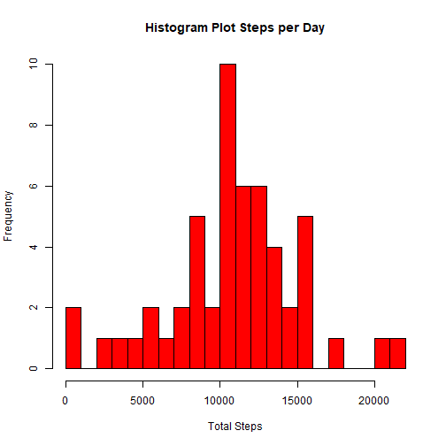

The data is read and saved in the *Activity* Data Frame 


```r
    Activity <- read.csv("activity.csv")
```

A fast look at the data:


```r
str(Activity)
```

```
## 'data.frame':	17568 obs. of  3 variables:
##  $ steps   : int  NA NA NA NA NA NA NA NA NA NA ...
##  $ date    : chr  "2012-10-01" "2012-10-01" "2012-10-01" "2012-10-01" ...
##  $ interval: int  0 5 10 15 20 25 30 35 40 45 ...
```

A date format conversion is done in order to process the data, and a Weekday Column is added

```r
    Activity$date <- as.Date(strptime(Activity$date,"%Y-%m-%d"))
    Activity$weekday <- weekdays(Activity$date)
```

The data is analized. The Activity data frame is processed by grouping as date and the total steps for each day is generated. A new dataframe *Analysis* is created with the data

```r
    Analysis <- Activity %>% group_by(date) %>% summarise(
                Steps_Total = sum(steps))
```
      
A quick look at the data:


```r
xt <- xtable(summary(Analysis))
print(xt,type = "html", auto=TRUE)
```

<!-- html table generated in R 4.1.1 by xtable 1.8-4 package -->
<!-- Wed Dec 15 15:29:15 2021 -->
<table border=1>
<tr> <th>  </th> <th>      date </th> <th>  Steps_Total </th>  </tr>
  <tr> <td align="right"> X </td> <td> Min.   :2012-10-01   </td> <td> Min.   :   41   </td> </tr>
  <tr> <td align="right"> X.1 </td> <td> 1st Qu.:2012-10-16   </td> <td> 1st Qu.: 8841   </td> </tr>
  <tr> <td align="right"> X.2 </td> <td> Median :2012-10-31   </td> <td> Median :10765   </td> </tr>
  <tr> <td align="right"> X.3 </td> <td> Mean   :2012-10-31   </td> <td> Mean   :10766   </td> </tr>
  <tr> <td align="right"> X.4 </td> <td> 3rd Qu.:2012-11-15   </td> <td> 3rd Qu.:13294   </td> </tr>
  <tr> <td align="right"> X.5 </td> <td> Max.   :2012-11-30   </td> <td> Max.   :21194   </td> </tr>
  <tr> <td align="right"> X.6 </td> <td>  </td> <td> NA's   :8   </td> </tr>
   </table>

## Histogram Plot

An histogram plot of the total steps during the time period:



Now the Mean and Median of the steps taken per day is calculated:

```r
Steps_Mean <- mean(Analysis$Steps_Total, na.rm = TRUE)
Steps_Median <- median(Analysis$Steps_Total, na.rm = TRUE)
```

The mean of total number of steps per day is 10766.19

The median of total number of steps per day is 10765.00


## Interval Analysis
We analize the 5 minutes interval per day averaged across all days, to check how
the activity is during the day


```r
  Analysis_5min <- Activity %>% group_by(interval) %>% summarise(
                Steps_Average_5min = mean(steps, na.rm = TRUE))
```

and ploting the data during the day:


```r
Interval_Max_Aver <- max(Analysis_5min$Steps_Average_5min)
Interval_Max <- as.integer(Analysis_5min[Analysis_5min$Steps_Average_5min == Interval_Max_Aver,1])
```

The maximum averaged number of steps is 206.17 at
the interval 835

## NA´s Analysis
Now we verify the number of NA´s present in the dataset:


```r
 NA_Total <- sum(is.na(Activity$steps))
 Percentage <- NA_Total / dim(Activity)[1] *100
```

We have a total of  2304 NA´s in the data, accounting for a 
            13.11% of the total

We devise a strategy for filling in the NA´s, by replacing them with the mean
    value of the corresponding 5 minute interval of the whole dataset.

A new column is created in the activity dataset


```r
  Activity$steps_filled <- Activity$steps
    for(i in 1:dim(Activity)[1]) {
      if(is.na(Activity$steps[i])){
        Interval <- Activity$interval[i]
        Activity$steps_filled[i] <- as.numeric(Analysis_5min[Analysis_5min$interval
                                                          == Interval,2])
      }
    }
```

An histogram plot is generated to analyse the effect of the NA´s replacement:


```r
    Analysis_no_na <- Activity %>% group_by(date) %>% summarise(
                        Steps_Total = sum(steps_filled))
    
    hist(Analysis_no_na$Steps_Total,xlab = "Total Steps",
         main = "Histogram Plot Steps per Day, no NA´s ", col="blue",breaks = 30)
```


There is a clear increase in the highest frequency count.

Calculating the mean and median of the new dataset,


```r
    Steps_Mean_filled <- mean(Analysis_no_na$Steps_Total)
    Steps_Median_filled <- median(Analysis_no_na$Steps_Total)  
```

For the "filled NA´s" the mean of total number of steps per day 
is 10766.19, against the previous 
10766.19 steps

The median of total number of steps per day is 
now 10766.19, against the previous 
10765.00

It is clear that both the average and median are not compromised


## Difference between Weekdays and weekdays

We analyse the difference between the excersice performed during weekdays and weekends.
For that matter, we create a new factor column with the type of day (weekday, weekend)


```r
    for(i in 1:dim(Activity)[1]) {
      if(Activity$weekday[i] == "Saturday" | Activity$weekday[i] == "Sunday"){
          Activity$day_type[i] <- "Weekend"
      }
      else{
          Activity$day_type[i] <- "Weekday"
      }
    }
```

The dataset is now averaged for every time interval, for both the weekdays and 
weekends. A new set is formed:


```r
    Analysis_weekday <- Activity %>% filter (day_type == "Weekday") %>% 
          group_by(interval) %>% summarise(Steps_Avrg_5min = mean(steps_filled), 
                                           day = "Weekday" )
    Analysis_weekend <- Activity %>% filter (day_type == "Weekend") %>%
          group_by(interval) %>% summarise(Steps_Avrg_5min = mean(steps_filled),
                                           day = "Weekend")
      
    Analysis_week <- merge(Analysis_weekday,Analysis_weekend,all = TRUE)
```

The difference is shown as a panel plot of the time series of the number of steps taken.
The median value for both cases is drawn as an horizontal line:


```r
library(lattice)
    xyplot(Steps_Avrg_5min ~ interval | day, data = Analysis_week, type = "l",
           xlab="Interval", ylab = "Average Steps", panel = function(x,y,...){
             panel.xyplot(x,y, ...)
             panel.abline(h = median(y), lty = 2)
           })
```


Results are clear: there is a subtle increase of excercise during weekends


